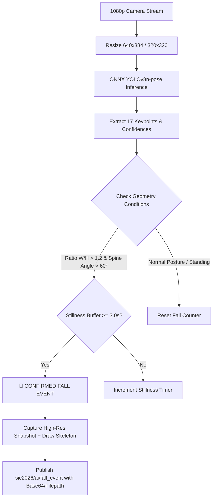

# Edge AI Fall Detection & Computer Vision Skill

This skill provides step-by-step procedures, mathematical models, and deployment runbooks for running real-time fall detection using **YOLOv8-pose** optimized with **ONNX Runtime** on the Raspberry Pi 5 Edge Gateway (Arm Cortex-A76 @ 2.4GHz).

---

## 🎯 Target Performance & Metrics
- **FPS Target**: $\ge 25\text{ FPS}$ on Raspberry Pi 5 (Quad-Core 2.4GHz / 4GB/8GB RAM) using ONNX Runtime with CPU acceleration (`intra_op_num_threads=4`).
- **Detection Latency**: $< 100\text{ms}$ per frame inference.
- **Accuracy Target**: $> 90\%$ true positive rate for sudden falls; low false alarm for sitting/lying.

---

## 📂 Sub-Documentation & References

- **Fall Detection Geometric Heuristics**: [references/fall_detection_algorithms.md](references/fall_detection_algorithms.md)
  - Mathematical definition of Trunk Angle ($\theta_{spine}$), Bounding Box Aspect Ratio ($W/H$), Keypoints velocity, and Temporal Stillness Buffer.
- **Pi 5 ONNX Model Optimization**: [references/raspberry_pi5_onnx_optimization.md](references/raspberry_pi5_onnx_optimization.md)
  - Exporting `yolov8n-pose.pt` to ONNX, ARM Cortex-A76 NEON precision, threading configuration, and memory management.
- **Production Pipeline Script**: [examples/fall_detector_pipeline.py](examples/fall_detector_pipeline.py)
  - Complete Python OpenCV pipeline with thread-safe camera capture, pose inference, fall state machine, snapshot buffer, and MQTT publisher.

---

## 🧠 Detection Logic Overview

