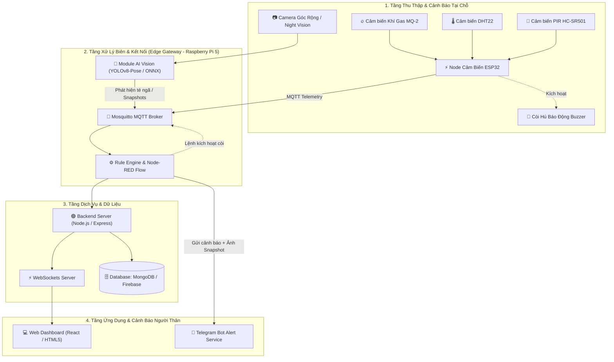
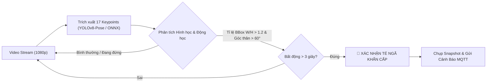

# 🏠 Hệ Thống Smart Home Kết Hợp Camera AI Giám Sát & Bảo Vệ Người Cao Tuổi
### *(Elderly Care Smart Home & Computer Vision AI Ecosystem)*

<div align="center">

[](https://www.samsung.com)
[](https://www.raspberrypi.com/)
[](https://github.com/ultralytics/ultralytics)
[](https://mqtt.org/)
[](#license)

</div>

---

## 📖 Giới Thiệu Dự Án (Overview)

Trong xã hội hiện đại, xu hướng già hóa dân số ngày càng tăng nhanh. Rất nhiều người cao tuổi phải ở nhà một mình trong suốt thời gian người thân đi làm. Các nguy cơ rủi ro như **tai nạn té ngã**, **đột quỵ bất ngờ**, **rò rỉ khí gas/cháy nổ**, hoặc **sốc nhiệt** đe dọa trực tiếp tới tính mạng nếu không được phát hiện và cấp cứu kịp thời trong *"khung giờ vàng"*.

Dự án **Smart Home & Vision AI Monitoring for Elderly** được phát triển trong khuôn khổ chương trình **Samsung Innovation Campus (SIC) 2026 - IoT Chapter**. Hệ thống kết hợp giữa mạng cảm biến môi trường IoT và thị giác máy tính Edge AI để giám sát toàn diện, cảnh báo đa kênh tức thời (< 2 giây) mà **không đòi hỏi người già phải đeo các thiết bị ngoại vi vướng víu**.

---

## ✨ Tính Năng Nổi Bật (Key Features)

- 👁️ **Giám sát thị giác không xâm nhập (Non-intrusive AI Vision):** Camera AI trích xuất 17 điểm mốc cơ thể (Keypoints) bằng YOLOv8-pose theo thời gian thực để phát hiện té ngã hoặc trạng thái bất động kéo dài.
- ⚡ **Cảnh báo đa kênh tức thời (< 2s):** Khi xảy ra sự cố (té ngã hoặc rò rỉ khí gas), hệ thống lập tức:
  - 🚨 Hú còi báo động âm lượng lớn (Buzzer) tại nhà.
  - 📱 Gửi thông báo khẩn cấp qua **Telegram Bot** kèm ảnh chụp khoảnh khắc sự cố (Snapshot).
  - 🖥️ Đẩy cảnh báo đỏ (Red Alert) thời gian thực lên **Web App Dashboard**.
- 🌡️ **Giám sát môi trường & Hiện diện:** Thu thập liên tục chỉ số nhiệt độ, độ ẩm phòng (DHT22), khí gas độc hại/khói (MQ-2) và tần suất di chuyển (PIR HC-SR501).
- 🔒 **Edge Computing & Bảo vệ quyền riêng tư:** Xử lý AI trực tiếp tại biên trên Raspberry Pi 5 (Quad-Core Cortex-A76 @ 2.4GHz), không truyền luồng video nhạy cảm lên Cloud công cộng.
- 📊 **Web Dashboard Trực Quan:** Xem luồng Live Camera, giám sát biểu đồ telemetry môi trường và tra cứu lịch sử sự cố.

---

## 🏛️ Kiến Trúc Hệ Thống (System Architecture)



---

## 🧠 Thuật Toán Camera AI Phát Hiện Té Ngã (AI Pipeline)



1. **Trích xuất Pose:** Trích xuất 17 điểm mốc giải phẫu học cơ thể (mắt, mũi, vai, hông, đầu gối, mắt cá) qua mô hình `yolov8n-pose` tối ưu định dạng **ONNX Runtime** (đạt 25–30+ FPS mượt mà trên Raspberry Pi 5).
2. **Phân tích hình thái:** Đo góc nghiêng cột sống (*Trunk Angle*) và tỉ lệ khung bao (*Bounding Box Aspect Ratio*).
3. **Xác thực ngưỡng thời gian:** Kết hợp dữ liệu cảm biến chuyển động PIR để loại bỏ báo động giả (False Positives).

---

## 🛠️ Danh Mục Phần Cứng (Hardware Components)

| STT | Thiết Bị / Linh Kiện | Thông Số Kỹ Thuật | Số Lượng | Chức Năng |
|:---:|:---|:---|:---:|:---|
| **1** | **Raspberry Pi 5 Model B** | Quad-core 64-bit Arm Cortex-A76 @ 2.4GHz, 4GB/8GB RAM, PCIe 2.0 | 01 | Edge Gateway, chạy AI Pose Estimation, MQTT Broker & Backend |
| **2** | **Camera Module / USB Webcam** | Full HD 1080p, Góc rộng 90°-110°, Hỗ trợ hồng ngoại ban đêm | 01 | Thu nhận luồng hình ảnh giám sát người cao tuổi |
| **3** | **ESP32 DevKit V1** | Dual-core Tensilica LX6, Wi-Fi 802.11 b/g/n | 02 | Node IoT thu thập cảm biến môi trường và điều khiển còi hú |
| **4** | **Cảm biến Gas/Khói MQ-2** | Phát hiện LPG, butane, propane, methane, khói | 01 | Cảnh báo rò rỉ gas và nguy cơ hỏa hoạn nhà bếp |
| **5** | **Cảm biến Nhiệt - Ẩm DHT22** | Dải đo -40~80°C (±0.5°C), Độ ẩm 0-100% (±2%) | 02 | Giám sát nhiệt độ phòng, phòng ngừa sốc nhiệt |
| **6** | **Cảm biến Chuyển Động PIR** | Model HC-SR501, Góc quét 120°, tầm xa 3-7m | 02 | Giám sát sự hiện diện và mức độ vận động |
| **7** | **Còi Báo Động Buzzer** | Còi chíp 5V/12V, Âm lượng 85–90 dB | 02 | Phát âm thanh báo động tại chỗ khi có sự cố khẩn cấp |
| **8** | **Mạch Nối & Nguồn Cấp** | Breadboard, Dây Dupont, Nguồn DC trực tiếp | 1 bộ | Kết nối mạch và cấp nguồn hoạt động 24/7 ổn định |

---

## 💻 Công Nghệ & Ngôn Ngữ Sử Dụng (Tech Stack)

- **Firmware & Embedded RTOS:** C/C++ (Arduino framework / PlatformIO), **FreeRTOS Dual-Core Multitasking** (Tasks Pinned to Cores, Thread-Safe Queues, Semaphores & Mutexes).
- **Edge AI & Computer Vision:** Python 3, OpenCV, Ultralytics YOLOv8, ONNX Runtime (Tối ưu hóa đa luồng ARM NEON trên Cortex-A76).
- **Message Broker & IoT Protocol:** Mosquitto MQTT Broker, WebSockets.
- **Automation & Rule Engine:** Node-RED / Custom Python Event Handler.
- **Backend API & Database:** Node.js, Express.js, MongoDB / Firebase Realtime.
- **Frontend Dashboard:** React.js / HTML5, CSS3, Chart.js, TailwindCSS.
- **Alert Service:** Telegram Bot API.

---

## 📂 Cấu Trúc Thư Mục Dự Án (Repository Structure)

```text
SIC2026_Smart-Home-Elderly-Care/
├── ai_vision/                  # Module Camera AI & Pose Estimation
│   ├── models/                 # Model YOLOv8-pose (.pt / .onnx)
│   ├── fall_detector.py        # Logic phân tích dáng điệu và phát hiện té ngã
│   └── camera_stream.py        # Xử lý luồng Camera và chụp snapshot
├── firmware_esp32/             # Mã nguồn Firmware cho các Node ESP32
│   ├── node_sensors/           # ESP32 đọc MQ-2, DHT22, PIR và publish MQTT
│   └── node_buzzer/            # ESP32 điều khiển còi hú cảnh báo
├── backend/                    # Backend API và Data Handler
│   ├── config/                 # Cấu hình MQTT, DB, Telegram Token
│   ├── routes/                 # RESTful APIs
│   ├── services/               # Telegram Bot Service & Alert Dispatcher
│   └── server.js               # Khởi tạo Server & WebSockets
├── frontend_dashboard/         # Giao diện Web App theo dõi
│   ├── public/
│   ├── src/
│   │   ├── components/         # Live Camera, Sensor Cards, Alert Modal
│   │   └── App.js
│   └── package.json
├── nodered_flows/              # File export kịch bản Rule Engine (flows.json)
├── docs/                       # Tài liệu Proposal, Sơ đồ nguyên lý, Slide thuyết trình
└── README.md                   # Tài liệu hướng dẫn dự án
```

---

## 🚀 Hướng Dẫn Cài Đặt & Chạy Hệ Thống (Getting Started)

### 1. Chuẩn Bị Môi Trường trên Raspberry Pi 5 (Raspberry Pi OS 64-bit Bookworm)
```bash
# Cập nhật hệ thống
sudo apt update && sudo apt upgrade -y

# Cài đặt Mosquitto MQTT Broker
sudo apt install mosquitto mosquitto-clients -y
sudo systemctl enable mosquitto
sudo systemctl start mosquitto

# Cài đặt Node.js & Python Virtual Environment
sudo apt install python3-pip python3-venv python3-opencv nodejs npm -y

# Tạo môi trường ảo Python
python3 -m venv ~/elderly_env
source ~/elderly_env/bin/activate
```

### 2. Chạy Module Camera AI Fall Detection
```bash
cd ai_vision
source ~/elderly_env/bin/activate
pip install -r requirements.txt
python3 fall_detector.py
```

### 3. Khởi Chạy Backend & Telegram Service
```bash
cd backend
npm install
# Tạo file .env chứa BOT_TOKEN, CHAT_ID, MQTT_BROKER
npm start
```

### 4. Khởi Chạy Frontend Dashboard
```bash
cd frontend_dashboard
npm install
npm start
```

---

## 👥 Phân Công Thành Viên & Vai Trò (Team Members)

| STT | Thành Viên | Vai Trò Chính | Nhiệm Vụ Trọng Tâm |
|:---:|:---|:---|:---|
| **1** | **Thành viên 1** *(Trưởng nhóm)* | Hardware & Embedded Firmware | Thiết kế sơ đồ nguyên lý, lập trình Firmware ESP32 đọc cảm biến & điều khiển Buzzer. |
| **2** | **Thành viên 2** | AI Computer Vision & Edge AI | Lập trình YOLOv8-pose, tối ưu ONNX, thuật toán nhận diện té ngã và trích xuất snapshot. |
| **3** | **Thành viên 3** | Backend API & Database | Cấu hình MQTT Broker, xây dựng Node.js RESTful API, WebSockets và quản lý Database. |
| **4** | **Thành viên 4** | Frontend Web Dashboard | Thiết kế UI/UX Dashboard, biểu đồ telemetry và hiển thị Live Stream realtime. |
| **5** | **Thành viên 5** | Automation & Alert System | Thiết lập kịch bản Node-RED, tích hợp Telegram Bot gửi cảnh báo kèm hình ảnh tức thì. |
| **6** | **Thành viên 6** | System Integration, QA & Docs | Kiểm thử toàn hệ thống (End-to-End), đóng gói mô hình phần cứng, hoàn thiện Slide & Báo cáo. |

---

## 📅 Lộ Trình Triển Khai (Roadmap: 19/08 – 13/09/2026)

- [x] **Tuần 1 (19/08 - 25/08):** Thiết kế Architecture, chuẩn bị linh kiện, chốt Proposal và dựng môi trường phát triển.
- [ ] **Tuần 2 (26/08 - 01/09):** Phát triển Core nhúng ESP32, xây dựng thuật toán Camera AI YOLOv8-pose, dựng khung Backend & Web Dashboard.
- [ ] **Tuần 3 (02/09 - 08/09):** Tích hợp liên hoàn (ESP32/AI ➔ MQTT ➔ Backend ➔ Telegram & Dashboard), tự động hóa còi hú và thông báo.
- [ ] **Tuần 4 (09/09 - 13/09):** Tối ưu giảm báo động giả, kiểm thử chịu tải, hoàn thiện Slide thuyết trình, Video Demo và nghiệm thu Capstone.

---

## 🎯 Tiêu Chí Nghiệm Thu (Target Metrics)

- **Độ chính xác AI Té ngã:** $> 90\%$ trên luồng video thời gian thực.
- **Thời gian phản ứng cảnh báo:** $< 2.0\text{ giây}$ (từ lúc ngã đến khi Telegram nhận được tin nhắn kèm ảnh snapshot).
- **Độ ổn định hệ thống:** Hoạt động liên tục 24/7, tỷ lệ mất gói tin MQTT $< 1\%$.
- **Giao diện người dùng:** Tương thích linh hoạt (Responsive) trên cả PC và Smartphone.

---

## 📜 Bản Quyền & Giấy Phép (License)
Dự án được thực hiện phục vụ học tập và nghiên cứu trong khuôn khổ **Samsung Innovation Campus 2026**. Mã nguồn được phân phối dưới giấy phép [MIT License](LICENSE).
